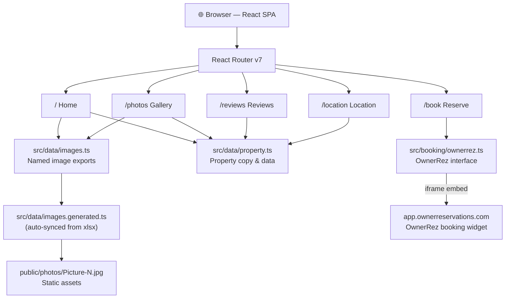
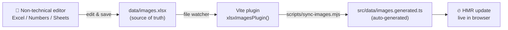

# Nirvana Cabin

Luxury vacation rental website for **Nirvana Cabin** in Broken Bow, Oklahoma.
Built with React 19 · Vite · TypeScript · Tailwind CSS v4 · React Router v7.

---

## Architecture

### Application layer



### Content authoring flow

Captions, alt text, and category for each photo live in a spreadsheet. A Vite
plugin watches the file and regenerates the TypeScript module on every save.



### Booking integration

The `/book` page embeds the OwnerRez booking widget in an `<iframe>` once
`VITE_OWNERREZ_PROPERTY_ID` is set. Without it, the page falls back to phone
and email contact details.

---

## Quick start

```bash
git clone <repo-url>
cd nirvana-cabin
npm install
cp .env.example .env       # fill in VITE_OWNERREZ_PROPERTY_ID
npm run dev
```

Open [http://localhost:5174](http://localhost:5174).

### Environment variables

| Variable | Description |
|---|---|
| `VITE_OWNERREZ_PROPERTY_ID` | OwnerRez property ID (Settings → Properties → [property]) |
| `VITE_CONTACT_EMAIL` | Optional override for the displayed contact email |

---

## Editing photo captions and categories

**For non-technical editors**, everything lives in one spreadsheet:
[`data/images.xlsx`](data/images.xlsx).

### Columns

| Column | Required | Description |
|---|---|---|
| `id` | ✅ | Picture number (1–70). Do not edit — matches the filename. |
| `filename` | — | Reference only. Not read by the app. |
| `alt` | ✅ | Short accessibility label (e.g. `"Living room with fireplace"`). |
| `caption` | ✅ | Marketing line shown on hover and in the lightbox. |
| `category` | ✅ | One of: `exterior`, `living`, `kitchen`, `bedroom`, `bathroom`, `outdoor`, `gameroom`. Invalid values fall back to `exterior` with a warning. |

### Workflow

1. Open `data/images.xlsx` in Excel, Numbers, or Google Sheets.
2. Edit the `alt`, `caption`, and `category` columns.
3. **Save the file.** While `npm run dev` is running, the page refreshes automatically.
4. For a production build, `npm run build` re-syncs before bundling.

### Adding a new picture

1. Drop the file in `public/photos/` using the naming convention `Picture-N.jpg`
   (unpadded — `Picture-71.jpg`, not `Picture-071.jpg`).
2. Open `data/images.xlsx`, append a new row with the matching `id` and `filename`, fill in the other columns.
3. Save. Vite HMR picks it up.

### Featured pictures (home page hero, editorial sections)

[`src/data/images.ts`](src/data/images.ts) exports named constants that pick
specific pictures for featured slots:

```ts
export const heroImage     = images.find((i) => i.id === "58")!;
export const hotTubImage   = images.find((i) => i.id === "41")!;
// …
```

To swap the picture used in a slot, change the id in the `find` call. This file
is the only place a developer needs to touch for image wiring.

---

## Project structure

```
nirvana-cabin/
├── data/
│   └── images.xlsx              # ← source of truth for captions/categories
├── public/
│   └── photos/                  # Picture-1.jpg … Picture-70.jpg (committed)
├── scripts/
│   ├── seed-images-xlsx.mjs     # One-time generator for the xlsx template
│   └── sync-images.mjs          # xlsx → src/data/images.generated.ts
├── src/
│   ├── booking/
│   │   └── ownerrez.ts          # OwnerRez widget URL helpers + env wiring
│   ├── components/layout/
│   │   ├── Header.tsx           # Transparent-on-hero, scroll-aware nav
│   │   ├── Footer.tsx
│   │   └── Layout.tsx
│   ├── data/
│   │   ├── images.ts            # Named image exports + getByCategory
│   │   ├── images.generated.ts  # ⚠️ AUTO-GENERATED from xlsx
│   │   └── property.ts          # All property copy: name, bedrooms, rules, etc.
│   └── pages/
│       ├── HomePage.tsx
│       ├── PhotosPage.tsx       # Filterable masonry gallery + lightbox
│       ├── ReviewsPage.tsx
│       ├── LocationPage.tsx
│       └── BookPage.tsx         # OwnerRez widget or contact fallback
├── .env.example
└── vite.config.ts               # Includes the xlsx file-watcher plugin
```

---

## Available scripts

| Command | Description |
|---|---|
| `npm run dev` | Start Vite with HMR. Watches `data/images.xlsx` and auto-syncs. |
| `npm run build` | Runs `sync-images` → `tsc -b` → `vite build` → outputs to `dist/`. |
| `npm run preview` | Serve the production build locally. |
| `npm run sync-images` | Manual xlsx → TS sync. Rarely needed; `dev`/`build` run it automatically. |
| `npm run seed-images-xlsx` | Regenerate an empty 70-row xlsx template. Skips if the file already exists. |
| `npm run lint` | ESLint. |

---

## Deploying to production

The site is a fully static React SPA. `npm run build` produces a `dist/`
directory containing `index.html`, hashed JS/CSS bundles, and the full
`photos/` folder as static assets. Host it anywhere that serves static files
and supports SPA routing fallback to `index.html`.

### Pre-deploy checklist

- [ ] All 70 rows in `data/images.xlsx` have real `alt`, `caption`, and `category` values.
- [ ] Every `Picture-N.jpg` referenced in the xlsx exists in `public/photos/` at a reasonable size (target < 2 MB each — optimize with Squoosh / Sharp / ImageMagick).
- [ ] `.env` contains a real `VITE_OWNERREZ_PROPERTY_ID` (or the booking page will render the setup fallback instead of the widget).
- [ ] `npm run build` completes with no TypeScript errors.
- [ ] `npm run preview` opens cleanly and all images load.

### Option A — Vercel (recommended for this stack)

1. Push the repo to GitHub.
2. Go to [vercel.com/new](https://vercel.com/new) and import the repo.
3. Vercel auto-detects Vite. Accept defaults (`Build Command: npm run build`, `Output Directory: dist`).
4. Add environment variables in the Vercel dashboard:
   - `VITE_OWNERREZ_PROPERTY_ID`
   - `VITE_CONTACT_EMAIL` (optional)
5. Click **Deploy**. You get a `*.vercel.app` URL in ~60 seconds.
6. Attach your custom domain under **Settings → Domains** and update DNS at your registrar (Vercel provides exact records).

Every `git push` to `main` redeploys automatically; pull requests get preview deployments.

### Option B — Netlify

1. [app.netlify.com/start](https://app.netlify.com/start) → import from GitHub.
2. Build command: `npm run build` · Publish directory: `dist`.
3. Add the same env vars under **Site Settings → Environment Variables**.
4. Add this SPA fallback to [`public/_redirects`](public/_redirects) if it doesn't exist:
   ```
   /*    /index.html   200
   ```
5. Deploy. Attach custom domain under **Domain Management**.

### Option C — Cloudflare Pages

1. [dash.cloudflare.com](https://dash.cloudflare.com) → **Workers & Pages** → **Create application** → **Pages** → **Connect to Git**.
2. Build command: `npm run build` · Output directory: `dist`.
3. Add env vars under **Settings → Environment variables**.
4. Cloudflare handles SPA routing automatically.

### Option D — Any static host (S3+CloudFront, GitHub Pages, etc.)

1. `npm run build` locally.
2. Upload `dist/` to the host.
3. Configure SPA fallback so all unknown paths serve `/index.html` (otherwise `/photos`, `/book`, etc. 404 on direct load).

### Performance checks after deploy

Once live, run:
- **Lighthouse** (Chrome DevTools → Lighthouse tab) — target 90+ Performance score on mobile.
- **PageSpeed Insights** ([pagespeed.web.dev](https://pagespeed.web.dev)) — watch the LCP metric; it should be < 2.5s.

If images are slow, they're probably still too large. Target: hero under 500 KB, gallery images under 800 KB. Re-encode the originals with Squoosh or a Sharp script.

### Pointing a custom domain

All four hosts above give you a free SSL certificate and a one-click custom-domain setup. Typical DNS:

```
A     @    <host-ip>           # root domain
CNAME www  <host-subdomain>    # www subdomain
```

Vercel / Netlify / Cloudflare show you the exact values to set at your registrar (GoDaddy, Namecheap, Route 53, etc.).

---

## Design tokens

| Token | Value | Usage |
|---|---|---|
| Forest | `#1A2B22` | Primary dark, footer, section backgrounds |
| Gold | `#B8965A` | Accents, CTAs, eyebrow labels |
| Cream | `#F7F4EF` | Page background |
| Display font | Cormorant Garamond | All headings (`font-display`) |
| Body font | DM Sans | All body text |
