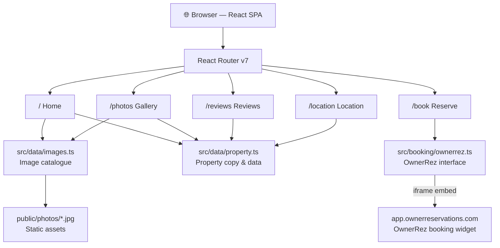
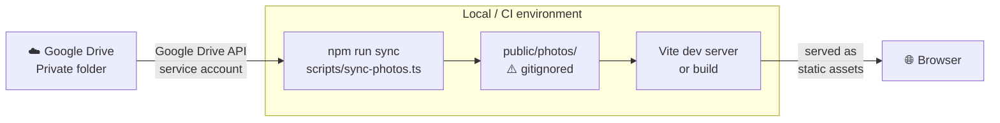
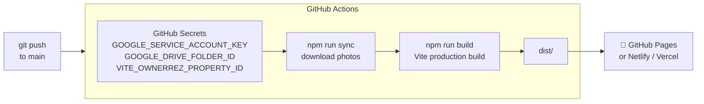

# Nirvana Cabin

Luxury vacation rental website for **Nirvana Cabin** in Broken Bow, Oklahoma.  
Built with React 19 · Vite · TypeScript · Tailwind CSS v4 · React Router v7.

---

## Architecture

### Application layer



### Photo storage & sync

Photos are **not committed to git** (65 files, ~2.5 GB). They live in a private Google Drive folder and must be synced locally before running the app.



### CI/CD deployment



### Booking integration

The `/book` page embeds the OwnerRez booking widget in an `<iframe>` once `VITE_OWNERREZ_PROPERTY_ID` is set. Without it, the page falls back to phone/email contact details.

---

## Quick start

### 1. Clone the repo

```bash
git clone <repo-url>
cd nirvana-cabin
npm install
```

### 2. Configure environment variables

```bash
cp .env.example .env
```

Open `.env` and fill in:

| Variable | Description |
|---|---|
| `VITE_OWNERREZ_PROPERTY_ID` | OwnerRez property ID (Settings → Properties → [property]) |
| `GOOGLE_SERVICE_ACCOUNT_KEY` | Service account JSON key — get this from the team |
| `GOOGLE_DRIVE_FOLDER_ID` | Google Drive folder ID containing the cabin photos |

### 3. Sync photos from Google Drive

```bash
npm run sync
```

This downloads all photos from the private Google Drive folder into `public/photos/`. You only need to re-run this if photos are added or updated on Drive.

### 4. Start the dev server

```bash
npm run dev
```

Open [http://localhost:5173](http://localhost:5173) (Vite may use `5174` etc. if the port is taken).

---

## Project structure

```
nirvana-cabin/
├── public/
│   └── photos/              # ← gitignored; populated by `npm run sync`
├── src/
│   ├── booking/
│   │   └── ownerrez.ts      # OwnerRez widget URL helpers + env wiring
│   ├── components/layout/
│   │   ├── Header.tsx        # Transparent-on-hero, scroll-aware nav
│   │   ├── Footer.tsx
│   │   └── Layout.tsx
│   ├── data/
│   │   ├── images.ts         # Image catalogue: id, url, caption, category
│   │   └── property.ts       # All property copy: name, bedrooms, rules, etc.
│   └── pages/
│       ├── HomePage.tsx
│       ├── PhotosPage.tsx    # Filterable masonry gallery + lightbox
│       ├── ReviewsPage.tsx
│       ├── LocationPage.tsx
│       └── BookPage.tsx      # OwnerRez widget or contact fallback
├── scripts/
│   └── sync-photos.ts        # Google Drive → public/photos/ sync script
├── .env.example
└── vite.config.ts
```

---

## Adding or updating photos

1. Upload the new JPG(s) to the Google Drive folder.
2. Run `npm run sync` locally to pull the new files.
3. Add an entry to `src/data/images.ts` with the correct filename, caption, and category.
4. To use a photo as a hero/editorial image in a page, add a named export to `images.ts` and import it directly in the page component.

---

## Available scripts

| Command | Description |
|---|---|
| `npm run dev` | Start Vite dev server with HMR |
| `npm run build` | Type-check + production build → `dist/` |
| `npm run preview` | Serve the production build locally |
| `npm run sync` | Sync photos from Google Drive → `public/photos/` |
| `npm run lint` | ESLint |

---

## Deployment

The site is a fully static SPA — `npm run build` outputs to `dist/`. It can be deployed to:

- **GitHub Pages** — push `dist/` via GitHub Actions (see `.github/workflows/`)
- **Netlify / Vercel** — point at the repo; set `npm run build` as the build command

In CI/CD, store `GOOGLE_SERVICE_ACCOUNT_KEY` and `GOOGLE_DRIVE_FOLDER_ID` as repository secrets. The workflow runs `npm run sync` before `npm run build` so photos are present in the build output.

---

## Design tokens

| Token | Value | Usage |
|---|---|---|
| Forest | `#1A2B22` | Primary dark, footer, section backgrounds |
| Gold | `#B8965A` | Accents, CTAs, eyebrow labels |
| Cream | `#F7F4EF` | Page background |
| Display font | Cormorant Garamond | All headings (`font-display`) |
| Body font | DM Sans | All body text |
